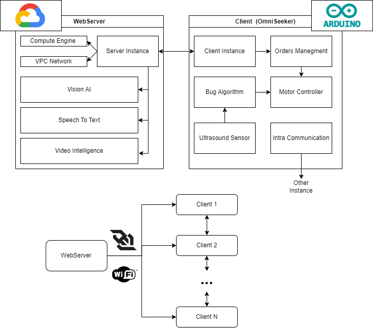
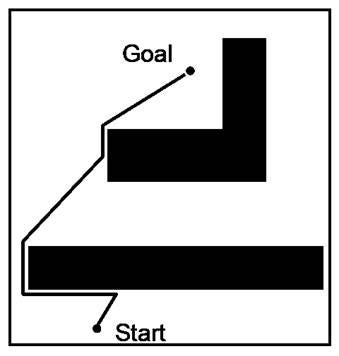

<div align="center">
 <a href="https://github.com/mserra0/OmniSeekers">
    
 </a>
 <br/>
 <p align="center">
    Robotic project aimed at revolutionizing tasks such as Search and Rescue with complete control of all robots in the swarm.
    <br />
 </p>
</div>

## Table of Contents
- [Description](#description)
- [Installation](#installation)
- [Details](#details)
  - [Software](#software)
  - [Hardware](#hardware)
- [Contributing](#contributing)
- [License](#license)
- [Contact](#contact)

## Description
This project presents an implementation of a swarm of omnidirectional robots with the aim of carrying out Search-and-Rescue tasks without the use of GPS or mapping such as SLAM. For this reason, we have based ourselves on exploration techniques based on Bug Algorithms, specifically on the Swarm Gradient Bug Algorithm (SGBA), presented in the article ["Minimal navigation solution for a swarm of tiny flying robots to explore an unknown environment"¹](https://www.science.org/doi/10.1126/scirobotics.aaw9710). The objective of this project is to present an efficient solution for the search for victims and targets in indoor environments where human access can pose a risk. To carry out the coverage of an extensive space in a consistent time, we have considered that the use of techniques developed in the field of Swarm Robotics is very suitable for distributing the exploration task among different entities with relatively simple objectives. Furthermore, this approach allows us to use affordable controllers that in other cases where computation would be more expensive. For the recognition of victims and the global coordination of the robots, a central server will be used from which computer vision techniques and movement control will be applied if it's necessary. 

We designed a 3-wheel omnidirectional robot base for our swarm of robots because it uses fewer components, is lighter in weight, and provides full mobility for the robots. We chose the ESP32 chipset as the robots' controller for both video transmission and robot control. This enables the robots to communicate with each other and the server efficiently, offering a fast and cost-effective implementation. 

### Structure
* **resources**: This folder contains all the images and assets used in the README documentation to enhance visual understanding and presentation.
* **3d design**: This folder holds all the 3D models and parts designed for the project, facilitating the creation and assembly of the robot’s physical components.
* **circuits**: This directory includes circuit diagrams created with Fritzint and KiCad. It contains separate designs for the standard circuit and the PCB layout, ensuring comprehensive documentation of the electronic components.
* **server**: This section is a forked repository of the Cloud server, enabling remote control and data management for the robot via Google Cloud services.
* **coppelia**: This folder stores all the simulation files used in CoppeliaSim, where various algorithms like the Bug Algorithm and Wall Following are tested and validated.

### Dependencies
- [](https://www.fritzint.com)
- [](https://kicad.org)
- [](https://cloud.google.com)
- [](https://www.python.org)
- [](https://www.arduino.cc)
- [](https://www.coppeliarobotics.com)
- [](https://nodejs.org)
- [](https://www.figma.com)
- [](https://www.blender.org)

## Setup & Install
To start this project, several important aspects need to be considered. The primary factor enabling the functionality of this swarm of robots is server control. Therefore, installing and initializing the server is necessary for the complete functionality of the project.

The server configuration is specified in the server folder repository. You can clone the GitHub repository and follow the steps provided for correct installation. Note that the server is designed to be remote and runs on Google Cloud services. However, it can also be executed locally.

```
git clone https://github.com/Alvaritox11/ServerBidireccional.git
```

After this, you need to continue with the configuration of each robot.

Development was done using Visual Studio. Our robot operates with MicroPython. To work with MicroPython, follow these steps:

1. Install the following tool:
```sh
pip install esptool
```

2. Find the corresponding firmware for your controller on this page: `https://micropython.org/download/`. We recommend saving the downloaded `.bin` file in the user directory where you will execute the project.

3. Next, execute the following command, specifying the controller you are using and the port where it is connected. Ensure the controller is connected and hold down the Boot button while executing the command.

```sh
esptool --chip esp32 --port COM10 erase_flash
```

4. Once done, the next command deploys the downloaded firmware to the connected controller. Change the `ESP32_GENERIC-20220116-v1.18.bin` file to the one you downloaded. Again, hold down the Boot button while executing the command.

```sh
esptool --chip esp32 --port COM10 --baud 460800 write_flash -z 0x1000 ESP32_GENERIC-20220117-v1.18.bin
```

5. Now, install the PyMakr extension in Visual Studio Code. This extension offers functionalities similar to ArduinoIDE, such as connecting devices, disconnecting, uploading files, and viewing the Serial Monitor. Installing additional libraries in the program is unnecessary, as MicroPython already includes many commonly used libraries.

6. Finally, download the various files from the src folder corresponding to the MicroPython code and upload them to the controller.

All the specified steps for configuring the robot are detailed in the page:
`https://docs.micropython.org/en/latest/esp32/tutorial/intro.html`

## Components
In this section, we provide an overview of the key components that make up the OmniSeekers project. Each component has been carefully selected to ensure optimal performance, reliability, and integration within the system.
| Name                                               | Units | Price   |
|----------------------------------------------------|-------|---------|
| ESP-WROOM-32 38 PINOUT                             | 1     | 11.99 € |
| ESP32-CAM                                          | 1     | 13.99 € |
| Motor Driver TD6612FNG                             | 2     | 4.95 €  |
| Motor N20 - 6V                                     | 3     | 4.50 €  |
| Omnidirectional Wheel 58mm                         | 3     | 10.76 € |
| Hub 4mm                                            | 3     | 0.99 €  |
| Micrometal Encoders x2                             | 2     | 8.50 €  |
| UltraSound HC-SR04                                 | 3     | 1.80 €  |
| PowerBank 5000mAh                                  | 1     | 11.99 € |
| Battery Holder 4xAA                                | 1     | 2.00 €  |
| **Total Price:**                                   |       | 121.02 € | 

The Total Price especified is only for a single robot.

## Details
In this section we will describe software and hardware details of our project. 

### Software
This section details the software architecture of the various interconnected modules of the robot, explaining how each component communicates and collaborates to ensure seamless operation.



### Hardware
#### Fritzint
Fritzint is used for connecting the robot's components to ensure proper functionality. This simple version provides a straightforward and efficient setup for integrating various hardware elements seamlessly.


#### KiCad
KiCad is utilized for creating a detailed schematic of the compact circuit to incorporate the PCB. This complex version ensures precise design and integration, enabling the development of high-quality printed circuit boards.


#### Blender
Blender is used to design our custom 3D components, allowing us to make the robot as compact as possible. Each piece is meticulously crafted to fit our specific requirements, ensuring optimal use of space and functionality. All parts are then 3D printed using a compatible program tailored to the specific printer being used. You can find the pieces in the `3Ddesign` folder.


## Tools & Libraries
To fully develop the project we need a series of specific tools and libraries to obtain the result we expected.

### Tools
* **[CoppeliaSim](https://www.coppeliarobotics.com/):** For robot simulation.
* **[JupyterNotebook](https://jupyter.org/):** For programming the simulation of robots connecting with CoppeliaSim.
* **[VisualStudioCode](https://code.visualstudio.com/):** For robot development with MicroPython.
* **[Fritzint](https://fritzing.org/):** For first concept of hardware connection.
* **[KiCad](https://www.kicad.org/):** For final circuit design and production of PCB.

### Libraries
The libraries used are mainly to accurately simulate with the help of Jupyter Notebook in Coppelia. As previously mentioned, MicroPython already contains many of the necessary libraries to run the program, so installing these libraries is not required for real tests. However, to run simulation tests, the following libraries need to be installed with the following command:

```sh
pip install -r requirements.txt
```

## Technical Concepts
In this section, we delve into the key technical concepts that underpin the functionality and performance of the OmniSeekers project. Understanding these concepts is essential for appreciating the intricacies of the robot's design and operation. We cover algorithms for navigation, methods for precise movement, and communication protocols that enable seamless integration with cloud services.

### Bug Algorithm
The Bug algorithm is a family of simple yet effective pathfinding algorithms used in robotics for navigation and obstacle avoidance. These algorithms are particularly useful in environments where the robot has no prior knowledge of obstacles and must navigate in real-time. We have chosen this method because we do not use GPS or other mapping techniques such as SLAM.

#### Wall Following
A key aspect of the Bug algorithm is the Wall Following technique. When the robot encounters an obstacle, it switches to a wall-following behavior, moving along the boundary of the obstacle until it can resume its path towards the target. This method ensures that the robot can navigate around obstacles and continue towards its goal efficiently.



### Odometry and Movement for 3-Wheeled Robots
Odometry is the use of data from motion sensors to estimate the change in position of a robot over time. For omnidirectional robots with three wheels, precise odometry is crucial to maintain accurate positioning and movement.

#### Omnidirectional Movement
An omnidirectional robot can move in any direction without changing its orientation. This is achieved through a specific arrangement of wheels and motors, allowing for smooth and flexible navigation. 


### Intra Robots Connection

AQUI PONER LA EXPLICACION DE LOS ROBOTS

## Demostration
Here's an example of what our swarm of omnidirectional robots can achieve.

Video de Youtube

## To Do
To advance this project, we have outlined several tasks that will significantly improve the robot's functionality and performance:

* **Connection Between Robots and Server:** Utilize an antenna to enhance the connection quality when using ESPNOW and WiFi. By improving the network infrastructure, we aim to expand the operational area, ensuring robust and reliable communication over a larger working field.

* **Robot Design:** Focus on miniaturizing both the robot's overall design and the PCB layout. This effort will make the robot more compact and agile, enhancing its operational efficiency and making it easier to navigate in confined spaces.

* **Bug Algorithm:** Upgrade the Bug Algorithm by integrating a gyroscope. This addition will provide more accurate directional changes and help maintain a consistent heading towards the target, improving the robot's navigation and obstacle avoidance capabilities.


## References

- 1. McGuire, K. N., De Wagter, C., Tuyls, K., Kappen, H. J., & de Croon, G. C. H. E. (2019). [Minimal navigation solution for a swarm of tiny flying robots to explore an unknown environment. Science Robotics](https://www.science.org/doi/10.1126/scirobotics.aaw9710)
- 2. maker.moekoe. (2023, 2 mayo). ESP32 based omnidirectional robots w/ camera | makermoekoe [Vídeo]. YouTube. https://www.youtube.com/watch?v=OIdMkZyhx7E
