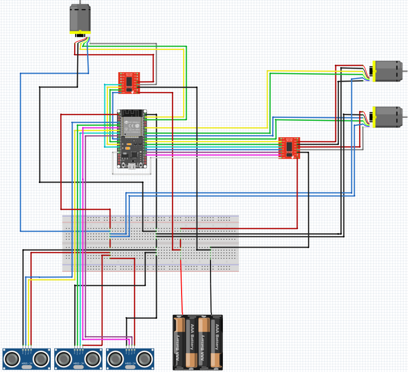
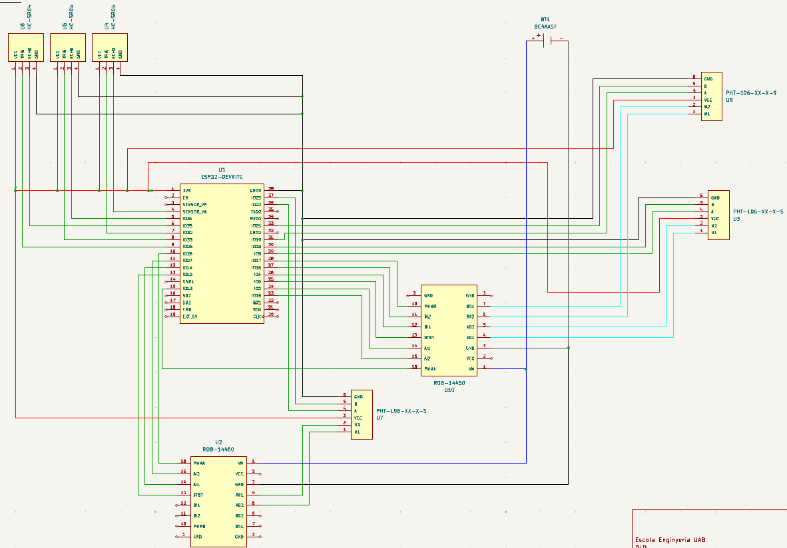

<div align="center">
 <a href="https://github.com/mserra0/OmniSeekers">
    
 </a>
 <br/>
 <p align="center">
    Robotic project aimed at revolutionizing tasks such as Search and Rescue with complete control of all robots in the swarm.
    <br />
 </p>
</div>

## Table of Contents
- [Description](#description)
- [Installation](#installation)
- [Details](#details)
  - [Software](#software)
  - [Hardware](#hardware)
- [Contributing](#contributing)
- [License](#license)
- [Contact](#contact)

## Description
This project presents an implementation of a swarm of omnidirectional robots with the aim of carrying out Search-and-Rescue tasks without the use of GPS or mapping such as SLAM. For this reason, we have based ourselves on exploration techniques based on Bug Algorithms, specifically on the Swarm Gradient Bug Algorithm (SGBA), presented in the article ["Minimal navigation solution for a swarm of tiny flying robots to explore an unknown environment"¹](https://www.science.org/doi/10.1126/scirobotics.aaw9710). The objective of this project is to present an efficient solution for the search for victims and targets in indoor environments where human access can pose a risk. To carry out the coverage of an extensive space in a consistent time, we have considered that the use of techniques developed in the field of Swarm Robotics is very suitable for distributing the exploration task among different entities with relatively simple objectives. Furthermore, this approach allows us to use affordable controllers that in other cases where computation would be more expensive. For the recognition of victims and the global coordination of the robots, a central server will be used from which computer vision techniques and movement control will be applied if it's necessary. 

We designed a 3-wheel omnidirectional robot base for our swarm of robots because it uses fewer components, is lighter in weight, and provides full mobility for the robots. We chose the ESP32 chipset as the robots' controller for both video transmission and robot control. This enables the robots to communicate with each other and the server efficiently, offering a fast and cost-effective implementation. 

### Structure
* resources:
* circuito:
* server:
* coppelia:

### Dependencies
- [](https://www.fritzint.com)
- [](https://kicad.org)
- [](https://cloud.google.com)
- [](https://www.python.org)
- [](https://www.arduino.cc)
- [](https://www.coppeliarobotics.com)
- [](https://nodejs.org)
- [](https://www.figma.com)
- [](https://www.blender.org)

## Install

```
pip install -r requirements.txt
```

## Components
In this section, we provide an overview of the key components that make up the OmniSeekers project. Each component has been carefully selected to ensure optimal performance, reliability, and integration within the system.
| Name                                               | Units | Price   |
|----------------------------------------------------|-------|---------|
| ESP-WROOM-32 38 PINOUT                             | 1     | 11.99 € |
| ESP32-CAM                                          | 1     | 13.99 € |
| Motor Driver TD6612FNG                             | 2     | 4.95 €  |
| Motor N20 - 6V                                     | 3     | 4.50 €  |
| Omnidirectional Wheel 58mm                         | 3     | 10.76 € |
| Hub 4mm                                            | 3     | 0.99 €  |
| Micrometal Encoders x2                             | 2     | 8.50 €  |
| UltraSound HC-SR04                                 | 3     | 1.80 €  |
| PowerBank 5000mAh                                  | 1     | 11.99 € |
| Battery Holder 4xAA                                | 1     | 2.00 €  |
| **Total Price:**                                   |       | 121.02 € | 

## Details
In this section we will describe software and hardware details of our project. 

### Software
This section details the software architecture of the various interconnected modules of the robot, explaining how each component communicates and collaborates to ensure seamless operation.


### Hardware
#### Fritzint
Fritzint is used for connecting the robot's components to ensure proper functionality. This simple version provides a straightforward and efficient setup for integrating various hardware elements seamlessly.


#### KiCad
KiCad is utilized for creating a detailed schematic of the compact circuit to incorporate the PCB. This complex version ensures precise design and integration, enabling the development of high-quality printed circuit boards.


#### Blender
Blender is used to design our custom 3D components, allowing us to make the robot as compact as possible. Each piece is meticulously crafted to fit our specific requirements, ensuring optimal use of space and functionality. All parts are then 3D printed using a compatible program tailored to the specific printer being used. You can find the pieces in the `3Ddesign` folder.


## Libraries

The following libraries are essential for the project:

  * **[CoppeliaSim](https://manual.coppeliarobotics.com/en/remoteApiClientSide.htm):** For robot simulation.
  * **[OpenCV](https://opencv.org/):** For computer vision and image processing.
  * **[NumPy](https://numpy.org/):** For numerical computations.
  * **[Scipy](https://www.scipy.org/):** For scientific computing.”
  * **[matplotlib](https://matplotlib.org/):** For plotting and visualizing data.

## To do

## References

- 1. McGuire, K. N., De Wagter, C., Tuyls, K., Kappen, H. J., & de Croon, G. C. H. E. (2019). [Minimal navigation solution for a swarm of tiny flying robots to explore an unknown environment. Science Robotics](https://www.science.org/doi/10.1126/scirobotics.aaw9710)
